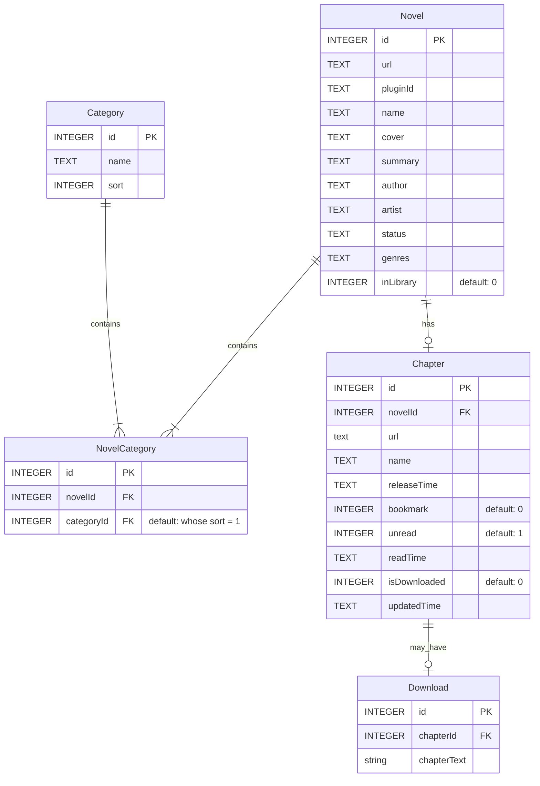

# Contributing Guide

Contributions are welcome and are greatly appreciated!

## Setting up your environment

After forking to your own github org or account, do the following steps to get started:

```bash
# prerequisites
node --version <= 16.13.1   (for version management, get nvm [recommended])
java sdk --version <= 11    (for version management, get jenv [optional])
android sdk                 (https://developer.android.com/studio)

# clone your fork to your local machine
git clone https://github.com/<your-account-name>/lnreader.git

# step into local repo
cd lnreader

# install dependencies
npm install --legacy-peer-deps

# build the apk (the built apk will be found in ~/lnreader/android/app/build/outputs/apk/release/)
npm run buildRelease
```

### Developing on Android

You will need an Android device or emulator connected to your computer as well as an IDE of your choice. (eg: vscode)

```bash
# prerequisites
adb                         (https://developer.android.com/studio/command-line/adb)
IDE

# check if android device/emulator is connected
adb devices

# run metro for development
npm start

# then to view on your android device (new terminal)
npm run android
```

To view any changes to the app with new code, save your code and press "r" on the metro terminal to
reload it. The app on the android device/emulator will reload shortly.

### Style & Linting

This codebase's linting rules are enforced using [ESLint](http://eslint.org/).

It is recommended that you install an eslint plugin for your editor of choice when working on this
codebase, however you can always check to see if the source code is compliant by running:

```bash
npm run lint
```
# Database

