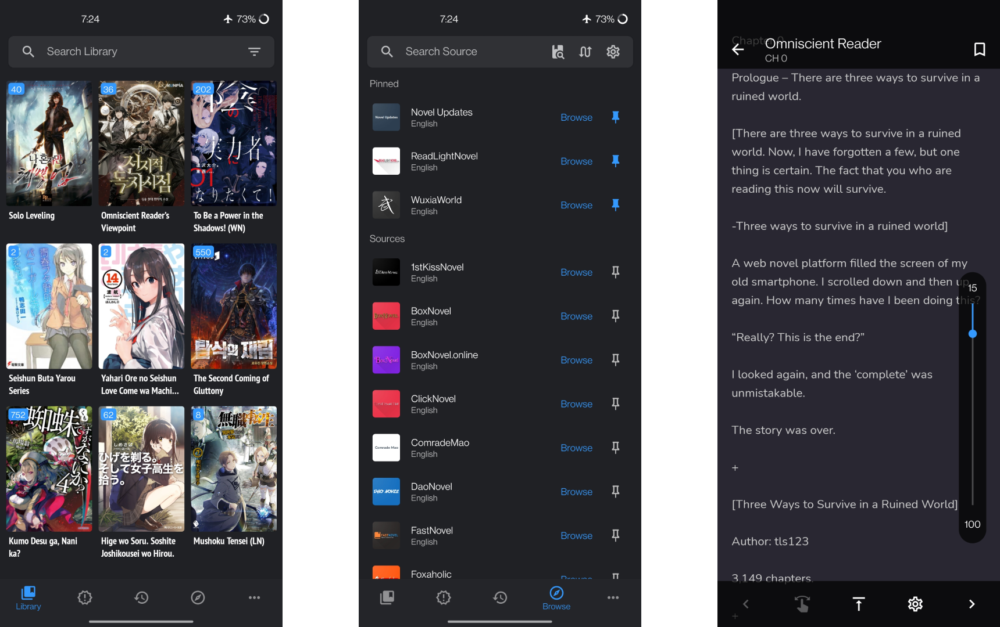

  

<h1 align="center">

  [LN](#)Reader

</h1>

  LNReader is a Tachiyomi-like, free and open source light novel reader for Android.

  
  
  
  
  
  

 
 

  

## Download

Get the app from our [releases page](https://github.com/LNReader/lnreader/releases).

## Plugins (extensions)

LNReader does not have any affiliation with the content providers available.

Plugin requests should be created at [LNReader/lnreader-plugins](https://github.com/LNReader/lnreader-plugins).

## Building & Contributing

See [CONTRIBUTING.md](./CONTRIBUTING.md)

## License

[MIT](https://github.com/rajarsheechatterjee/lnreader/blob/main/LICENSE)

## Tools

[Migration helper](https://lnreader.github.io/plugins-migration/)

[Backup tools](https://github.com/LNReader/remote-service)

[Discord Bot](https://github.com/LNReader/lnreader-bot)
