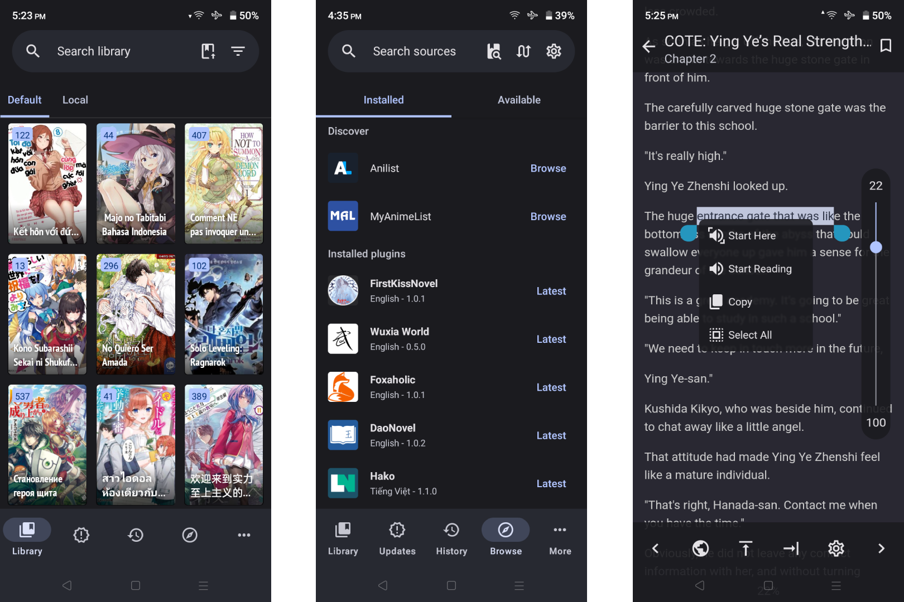

<h1 align="center">
   
  LNReader
   
</h1>

LNReader is a Tachiyomi-like, free and open source light novel reader for Android.

---

## Screenshots:

## Download
Get the app from our [releases page](https://github.com/rajarsheechatterjee/LNReader/releases).

## License
[MIT ](https://github.com/rajarsheechatterjee/lnreader/blob/main/LICENSE)
